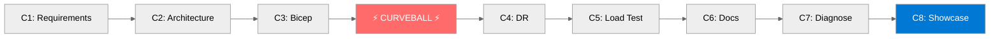

# Challenges

Eight challenges guide you through the full Infrastructure-as-Code lifecycle — from gathering requirements with an AI agent to presenting your solution in a partner showcase.

## Challenge Overview

| # | Challenge | Duration | Points |
|---|---|---|---|
| 1 | Requirements Capture | 30 min | 20 |
| 2 | Architecture Design | 30 min | 25 |
| 3 | Bicep Implementation & Deploy | 45 min | 25 |
| 4 | DR Curveball & Deploy | 45 min | 10 |
| 5 | Load Testing | 30 min | 5 |
| 6 | Workload Documentation | 15 min | 5 |
| 7 | Troubleshooting & Diagnostics | 5 min | 5 |
| 8 | Partner Showcase | 60 min | 10 |

**Total:** 105 base points + up to 25 bonus points

## Challenge Flow

> Challenge 4 is announced as a surprise midway through the event — simulating real-world requirement changes.
{: .note }
